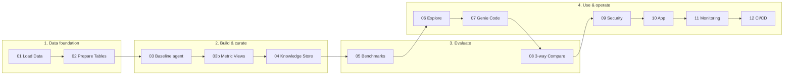
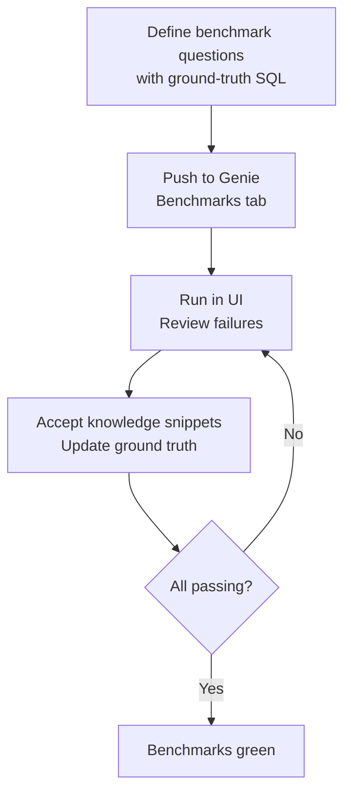
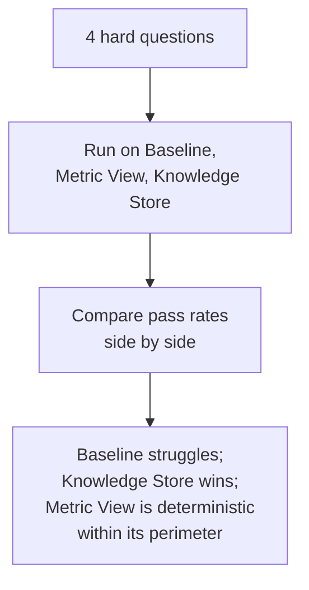

# Databricks Genie Agents Workshop — Manufacturing Quality Analytics

A hands-on workshop that teaches you to **build, curate, evaluate, and operate a production-ready Databricks Genie Agent** on manufacturing quality data — and to know when *not* to use one.

The core message: a Genie Agent is only as good as the **data foundation and curation** behind it. You'll build **three agents on the same data** and prove, with benchmarks, that curation is what earns trust:

- **Baseline** — tables only (the "before")
- **Metric View** — a governed semantic layer with pinned joins and KPI formulas
- **Knowledge Store** — measures, filters, fields, joins, synonyms, and example SQL (the "after", and your primary agent)

## Workshop flow



## What you will walk away with

- **A production-ready Genie agent** with a structured **Knowledge Store** (Notebook 04) — measures, joins, synonyms, and Q-to-SQL examples — instead of one brittle instructions blob.
- **A governed metric view** (Notebook 03b) that pins KPI formulas and joins in Unity Catalog — the "move the logic to the left" pattern.
- **Proof that curation matters** (Notebook 08) — the same hard questions run against baseline, metric-view, and Knowledge Store agents, side by side.
- **A repeatable evaluation workflow** (Notebook 05) — push benchmarks, run them in the UI, review failures with knowledge snippets, and iterate.
- **Security guardrails** (Notebook 09) — column masking with Unity Catalog, proving Genie respects row/column security.
- **A deployable app** (Notebook 10), **monitoring** (Notebook 11), and **CI/CD** (Notebook 12).

## Prerequisites

See **`PREREQUISITES.md`** for the full checklist. In short: a Databricks workspace with **Unity Catalog** and **Genie** enabled, a **Pro/Serverless SQL warehouse**, and privileges to `CREATE TABLE`, `CREATE VOLUME`, `CREATE FUNCTION`, and `CREATE VIEW` (metric views) in a sandbox catalog/schema.

## Getting started

1. Import the **`notebooks/`**, **`templates/`**, and **`skill/`** folders into your Databricks workspace so they sit side-by-side:

   ```
   /Workspace/Users/<your_email>/genie-agents-workshop/
     notebooks/        ← 15 notebooks (00–13, includes 03b)
     templates/        ← Genie agent configuration (reference)
     skill/            ← Genie Code skill file
   ```

2. Open **`00_workshop_config`** and set your **catalog** and **schema**.

3. Run notebooks **01 → 13** in order. Every notebook reads your config
   automatically via `%run ./00_workshop_config`.

   Notebook 10 generates the Databricks App source (`app.py`, `app.yaml`,
   `requirements.txt`) for you — there is no separate `app/` folder to import.

## Notebooks

| # | Notebook | What you will do |
|---|----------|-----------------|
| 00 | **Workshop Config** | Set your catalog, schema, and preferences |
| 01 | **Load Data** | Create 7 manufacturing tables (plants, lines, operators, events, quality metrics, safety, feedback) |
| 02 | **Prepare Data** | Add table comments, create analytics functions |
| 03 | **Baseline Agent** | Create a tables-only agent — the "before" for comparison |
| 03b | **Metric Views** | Build a governed metric view (semantic layer) and an agent on top of it |
| 04 | **Knowledge Store** | Curate programmatically: measures, filters, fields, joins, synonyms, example SQL — the primary agent |
| 05 | **Benchmarks** | Push benchmark questions, run in the UI, fix failures with knowledge snippets and ground-truth updates |
| 06 | **Explore with Genie** | Ask questions in the Genie UI, verify with reference SQL |
| 07 | **Genie Code Skills** | Use a Genie Code skill and a prompt to create an agent — no API code needed |
| 08 | **3-way Compare** | Run the same hard questions on baseline vs. metric-view vs. Knowledge Store agents |
| 09 | **Security** | Column masking with Unity Catalog — prove Genie respects row/column security |
| 10 | **Deploy App** | Wrap Genie in a Databricks App |
| 11 | **Monitoring** | Track accuracy, usage, and query performance over time |
| 12 | **CI/CD** *(optional)* | Promote Genie agents across environments with code |
| 13 | **Cleanup** *(optional)* | Remove all workshop assets (agents, metric view, tables, volume, app) |

## How the evaluation works

**Notebook 05** defines benchmark questions with ground-truth SQL and pushes them to the primary agent's **Benchmark** tab:



**Notebook 08** proves curation matters by running the same four hard questions against all three agents:



The benchmark questions **teach patterns** (state joins, ratio calculations, shift
aggregation). The four comparison questions in notebook 08 are intentionally
**different** — Genie must generalize from the curation, not memorize answers.

## Notebook-specific notes

- **07 — Skills:** Copy `skill/manufacturing-analytics_genie/SKILL.md` into your workspace's `.assistant/skills/` directory before running notebook 07.
- **09 — Security:** Replace `admin_group` with a real group in your workspace.
- **10 — App:** Notebook 10 generates the app source (`app.py`, `app.yaml`, `requirements.txt`) inline and deploys it — there is no committed `app/` folder.
- **11 — Monitoring:** Queries `system.access.audit` and `system.query.history`; the notebook handles missing access gracefully.

## Repository structure

```
├── notebooks/          15 workshop notebooks (00–13, includes 03b)
├── templates/          Genie agent configuration (reference)
│   └── manufacturing_genie_configured.json
├── skill/              Genie Code skill file
│   └── manufacturing-analytics_genie/
│       └── SKILL.md
├── WORKSHOP_PLAN.md    Facilitator plan + best-practices reference
├── PREREQUISITES.md    Attendee pre-work checklist
└── README.md
```

> Notebook 10 generates the Databricks App source at run time, so there is no committed `app/` folder.

## Compute

All notebooks run on **Serverless** compute. Classic clusters with Unity Catalog access also work.

## Troubleshooting

| Symptom | Fix |
|---------|-----|
| Notebook 03 / 03b / 04 fails to create an agent | Check Genie entitlement, SQL warehouse availability, and API permissions. |
| Wrong catalog in Genie answers | Ensure notebook 00 has the same catalog/schema you used in 01–02. |
| `CREATE VIEW ... WITH METRICS` errors in 03b | Metric-view YAML syntax varies by workspace version — check the docs for yours. |
| Benchmarks in wrong UI tab | Notebook 05 pushes benchmarks inside `serialized_space.benchmarks` (the GA API), so they land in the Benchmarks tab. |

## License and data

Sample data is **synthetic** — generated for training and demos, not real
production or customer data.

## Credits

Adapted and extended from an earlier internal Databricks manufacturing Genie workshop. The Genie Agents modernization — terminology, audit fixes, the metric-view and Knowledge Store notebooks, and the three-way comparison — was added on top.
